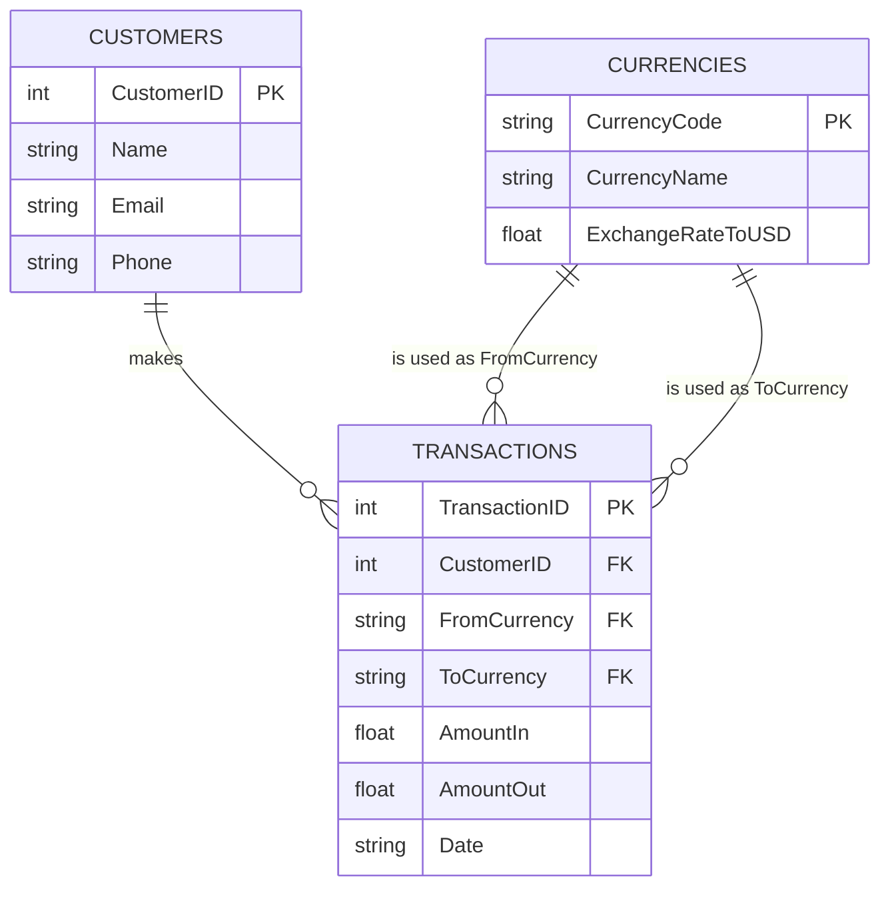

## Activity 5: Money Exchange Project

### Project Overview
This project is fully functional relational database for a Money Exchange business. Built using Python and SQLite3, the system uses a modular, Object-Oriented Programming (OOP) architecture. 

### Object-Oriented Architecture (OOP)
The functionality is divided across three modules:
* **`db_connection.py`:** Infrastructure. Handles the SQLite database connection and executes schema creation.
* **`exchange_services.py`:**  Logic. Takes the active connection and handles CRUD operations and exchange rate math.
* **`main.py`:** Execution. The entry point that instantiates the classes, feeds the hard-coded data, and triggers a transaction.

### Entity Relationship (ER) Diagram


### Database Schema & Table Justification
The database consists of three normalized tables:
* **1. `Customers` Table:** Decoupling customer details from transaction logs prevents redundant data entry and establishes a 1-to-Many relationship with transactions.
* **2. `Currencies` Table:** Consolidating rates into a single reference table allows the business to update a rate once, immediately applying it to all subsequent transactions. It is the source of truth for conversions.
* **3. `Transactions` Table:** Acts as the entity bridging customers and currencies. It is important for financial auditing, capturing exactly who initiated the exchange (`CustomerID`), the currencies involved (`FromCurrency`/`ToCurrency`), the processed amounts, and a precise timestamp.

### Hard-Coded Sample Data &  Execution
To demonstrate the functionality, base data is injected into the database upon execution, but the actual transaction is driven by interactive user input.

* **Pre-loaded Currencies:** USD (1.00), EUR (1.08), NZD (0.60).
* **Pre-loaded Customer:** A default "Manual User" profile is created to log the exchange.
* **Interactive Transaction:** The script pauses and prompts the user in the terminal to manually type the currencies and the amount they wish to exchange.

**How to Run:**
Execute `python main.py` in your terminal. 

**Expected CLI Output:**
The system will initialize, load the base data, and wait for your input.

```text
Initializing Money Exchange System...

--- Welcome to the Currency Exchange ---
Available Currencies: USD, EUR, NZD
Enter the currency you are converting FROM (e.g., NZD): NZD
Enter the currency you are converting TO (e.g., EUR): EUR
Enter the amount of NZD to convert: 1000

Processing...
Success! 1000.0 NZD was converted to 555.56 EUR.

System closed safely.
```